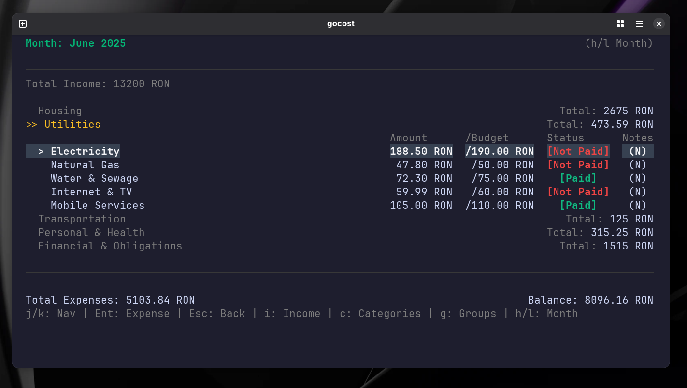

# gocost
[](https://pkg.go.dev/github.com/madalinpopa/gocost)

### Go cost your life... before it costs you

`gocost` is a simple, fast, and keyboard-driven Terminal User Interface (TUI) application for managing your monthly expenses. Built with Go and the Bubble Tea framework, it provides a streamlined way to track where your money is going without ever leaving the terminal.



## What is gocost?

**gocost** is an app for tracking your essential monthly bills and recurring costs—like rent, utilities, and subscriptions—to give you a clear picture of your total cost of living each month.

### What it is:
- A tool for monitoring your main monthly payment obligations
- Focused on tracking your essential "cost centers"
- Designed to show whether your bills have been paid
- Perfect for understanding your baseline monthly expenses

### What it's not:
- Not a detailed expense tracker for every purchase
- Not meant for tracking daily spending like coffee, meals, or shopping
- Not a budgeting app for discretionary spending

Instead of tracking every single transaction, gocost focuses on the big picture—helping you monitor the recurring costs that make up your monthly financial foundation.

## Features

- 📊 Monthly expense tracking with categories and groups
- 💰 Income management
- 📁 Category organization with groups
- 🔍 Category filtering by name or group
- 💾 Local JSON data persistence
- ⌨️ Keyboard-driven interface
- 🎨 Adaptive colors for light/dark terminals

### Keyboard Shortcuts

#### Global Navigation
- `q` / `Esc` - Go back/Quit
- `h` / `l` - Navigate between months
- `r` - Reset to current month (only shown when viewing a different month)
- `t` - Toggle expense status (only shown when navigate within month expenses)
- `i` - Manage income
- `c` - Manage categories
- `g` - Manage category groups

#### List Navigation
- `j` / `down` - Move down
- `k` / `up` - Move up
- `Enter` - Select/Edit
- `/` - Filter items (in category view)
- `c` - Clear filter (when filtered)
- `a` / `n` - Add new item
- `e` - Edit item
- `d` - Delete item
- `m` - Move category (in category view)
- `p` - Populate categories from previous month (when current month is empty)

#### Form Navigation
- `Tab` / `Shift+Tab` - Navigate between fields
- `Enter` - Save
- `Esc` - Cancel

#### Category Filtering
- `/` - Start filtering categories (in category view)
- `Enter` - Apply filter (while typing)
- `c` - Clear current filter
- `Esc` - Cancel filter input

The filter searches both category names and group names (case-insensitive). When a filter is active, you can still perform all normal operations (edit, delete, move) on the filtered results.

## Project Structure

```
gocost/
├── cmd/
│   └── gocost/
│       └── main.go          # Application entry point
├── internal/
│   ├── app/
│   │   ├── app.go           # Main application model and state management
│   │   ├── messages.go      # Message handlers for different actions
│   │   ├── status.go        # Status message management
│   │   └── status_test.go   # Status tests
│   ├── config/
│   │   ├── config.go        # Configuration management
│   │   └── config_test.go   # Configuration tests
│   ├── data/
│   │   ├── models.go        # Data structures (Income, Expense, Category, etc.)
│   │   ├── persistence.go   # JSON file load/save operations
│   │   └── persistence_test.go
│   └── ui/
│       ├── overview.go      # Monthly overview view
│       ├── income.go        # Income list view
│       ├── income_form.go   # Income add/edit form
│       ├── category.go      # Category management view
│       ├── category_group.go # Category group management
│       ├── expense.go       # Expense entry form
│       ├── style.go         # UI styling and colors
│       ├── types.go         # UI type definitions and messages
│       ├── util.go          # Utility functions
│       ├── util_test.go
│       └── validation.go    # Input validation
├── go.mod
├── go.sum
└── README.md
```

## Dependencies

- [Bubble Tea](https://github.com/charmbracelet/bubbletea) - TUI framework
- [Lipgloss](https://github.com/charmbracelet/lipgloss) - Style definitions
- [Viper](https://github.com/spf13/viper) - Configuration management
- [UUID](https://github.com/google/uuid) - Unique ID generation
- [Decimal](https://github.com/shopspring/decimal) - Precise decimal arithmetic

## Installation

### Download from GitHub Releases

Download the latest pre-built binary from the [GitHub Releases page](https://github.com/madalinpopa/gocost/releases):

1. Go to the [releases page](https://github.com/madalinpopa/gocost/releases)
2. Download the latest release for your platform
3. Extract and run the binary

### From source

```bash
go install github.com/madalinpopa/gocost/cmd/gocost@v1.1.3
```

### Build locally

```bash
git clone https://github.com/madalinpopa/gocost.git
cd gocost
go build -o gocost ./cmd/gocost
```

## Development Setup

1. **Clone the repository**
   ```bash
   git clone https://github.com/madalinpopa/gocost.git
   cd gocost
   ```

2. **Install dependencies**
   ```bash
   go mod download
   ```

3. **Run the application**
   ```bash
   go run ./cmd/gocost
   ```

4. **Run tests**
   ```bash
   go test ./...
   ```

5. **Build for development**
   ```bash
   go build -o gocost ./cmd/gocost
   ./gocost
   ```

## Data Storage

The application stores data in your home directory:
- Config: `~/.gocost/config.json`
- Data: `~/.gocost/expenses_data.json`

Currency symbol can be updated in `config.json`.

## Contributing

1. **Fork the repository**

2. **Create a feature branch**
   ```bash
   git checkout -b feature/your-feature-name
   ```

3. **Make your changes**
   - Follow Go best practices
   - Add tests for new functionality
   - Update documentation as needed

4. **Run tests and ensure they pass**
   ```bash
   go test ./...
   ```

5. **Commit your changes**
   ```bash
   git commit -m "Add your descriptive commit message"
   ```

6. **Push to your fork**
   ```bash
   git push origin feature/your-feature-name
   ```

7. **Create a Pull Request**
   - Describe your changes
   - Reference any related issues
   - Ensure all checks pass

### Code Style

- Use `gofmt` for formatting
- Follow [Effective Go](https://golang.org/doc/effective_go) guidelines
- Keep functions small and focused
- Add comments for exported functions

## License

MIT License

## Author

Madalin Popa
